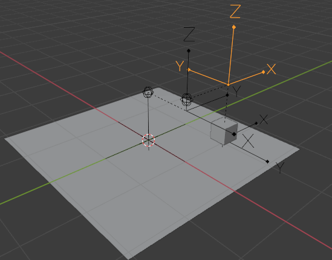
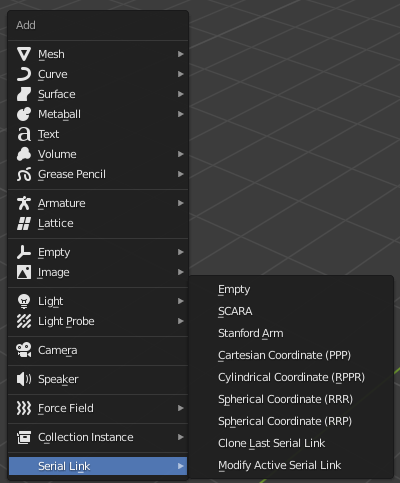
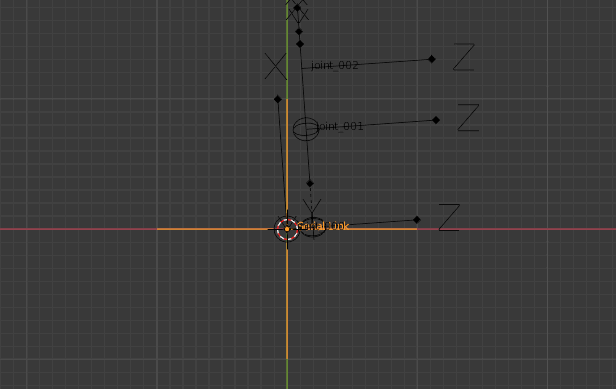

# Robo Arm :: Rigging

**Robo Arm :: Rigging** is a rigging addon for Blender that helps animating industrial robotic arms.
It construct serial links(a kind of robotic arms) from DH parameters using only vanilla features. Meaning, any output of this addon can be used in any environments, without corrupting a save file. The vanilla building blocks include **Empty**, **Constraints**, **Parenting**, **Animation Data**, and **Driver**. This addon requires blender API to be v2.80.0 or of any compatible version with v2.80.0.

# Add Menu

This addon push one entry group to the add menu: **Serial Link**. **Serial Link** helps generating rigging of a serial link with dedicated UI and presets.

Presets include SCARA, Stanford Arm, Cartesian Coordinate (PPP), Cylindrical Coordinate (RPPR), Spherical Coordinate (RRR) and Spherical Coordinate (RRP). You can modify a serial link that generated in this menu with **Modify Active Serial Link** entry once the base of the serial link is active.

# Serial Link

This addon comes with a dedicated UI for generating a serial link. You can specify DH parameters that describes a serial link to generate a rig for it.

By default, "variable screw", the one composed with "theta" and "d", are applied before "constant screw", the one composed with "alpha" and "a". There is also an alternative convention where the applying order of screw is reversed. You can switch to the alternative convention by unchecking the corresponding checkbox here.

This UI also support configuring whether a joint is prismatic or revolute, whether a joint is constrained, and how much the joint is constrained.

If you choose to **Lock constant parameters**, you can't change "alpha" and "a" parameters afterwards (unless you unlock them). If you choose not to, you can move joints as you normally would do, changing "alpha" and "a" parameters interactively.

If **Generate driver for joint varibles** is checked, driver for joint variables are generated on the base's object data of the current serial link. Joint variable here, means "theta" if the corresponding joint is revolute, or "d" if is prismatic. You can use this driver to animate the arm. This can be useful interface when you are given with forward kinematics animation data, or want to emulate mechanical motion.

# Inverse Kinematics (experimental)

I recommand using blender's native IK if that can solve your problem.
This feature isn't complete, heavy, and sometimes failed to reach goal even if the goal is reachable. The only advantage of this feature over the native one that I can think of is that, this feature repects prismatic joint's constraint. As far as I know, the closest way to introduce prismatic joint's constraint in native IK is that, restricting two virtual revolute joints and compose one real prismatic joint by connecting the two former virtual joints. This method also introduces redundant revolute joints that jump in both ends of the prismatic joint, and doesn't provide direct manipulation for parameters of the prismatic joint. I'm sure you can make this behavior looks intentional once your creativity is in charge. However if you've already given a concrete image of what you should create, only then, you may use this feature.

# About
This project is a running project that will be improved as I learn more about robotics. Although it isn't my top priority, I've always been interested in this topic. I'm planning to write scripts about what I learn to consolidate my understanding, and this project will be an archive for the scripts.

But, regardless of the purpose, I'll do my best to make this project "working" and "useful". This project should be functional normally as an addon. Final output of this project should be useful interface for people familiar with robotics.